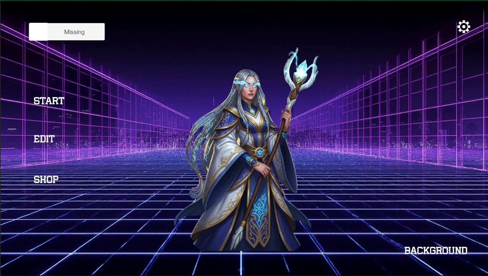
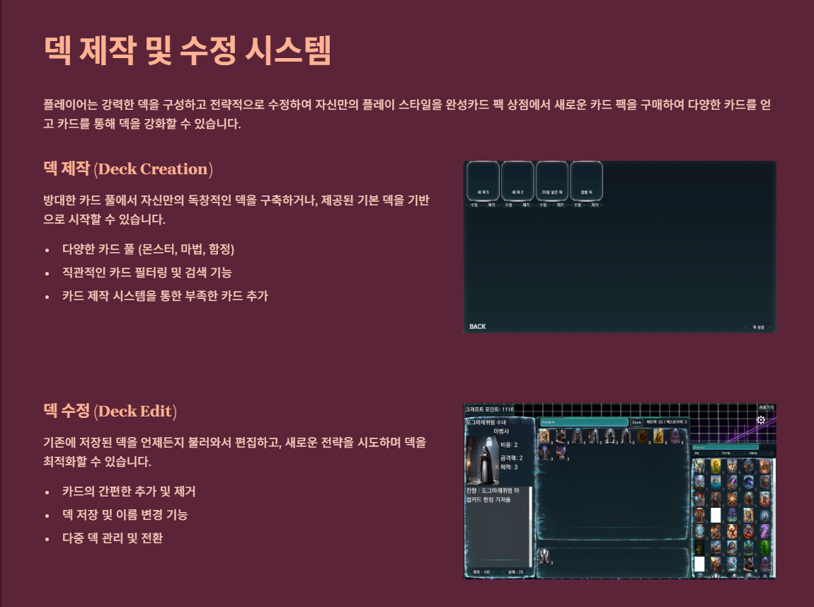
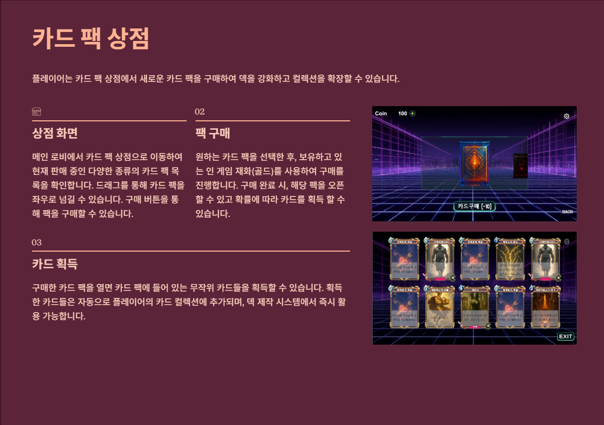
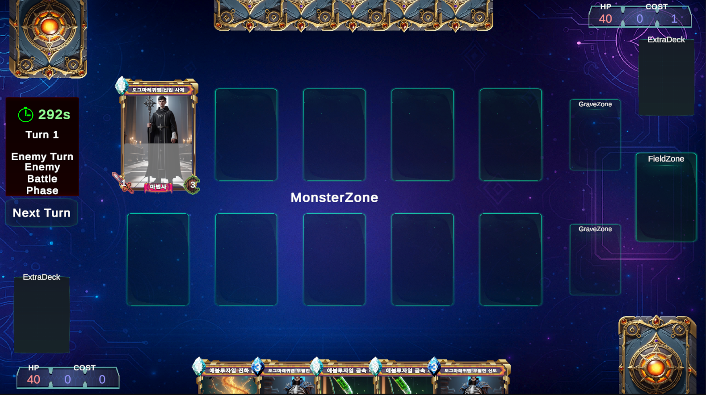
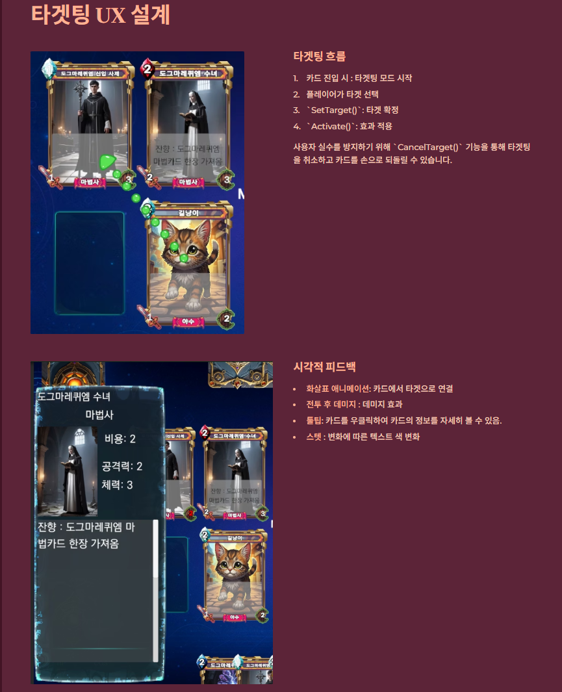

# Card Game
Unity 기반으로 제작 중인 카드 게임 프로젝트입니다.  
하스스톤 + 유희왕 스타일의 시스템을 혼합하여 구현하고 있습니다.

## 기능
- 카드 드로우 / 소환 / 발동 시스템
- 카드 효과 조건(턴 시작/종료, 소환 시 등)
- 덱 빌더 및 덱 저장 기능
- 묘지 시스템
- 인게임 카드 상세 보기 UI

##로비

##덱제작

##샵

##인게임

